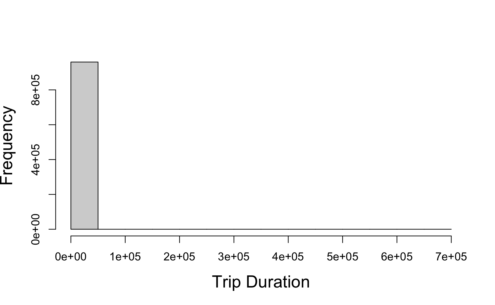
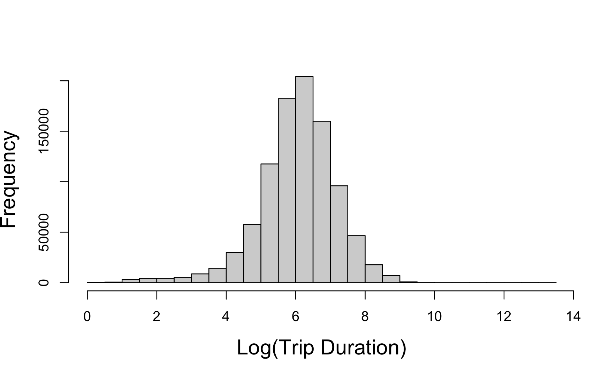
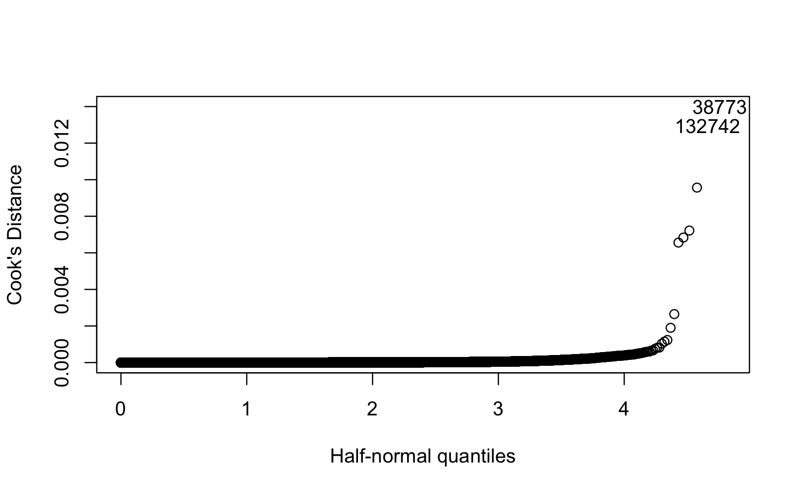
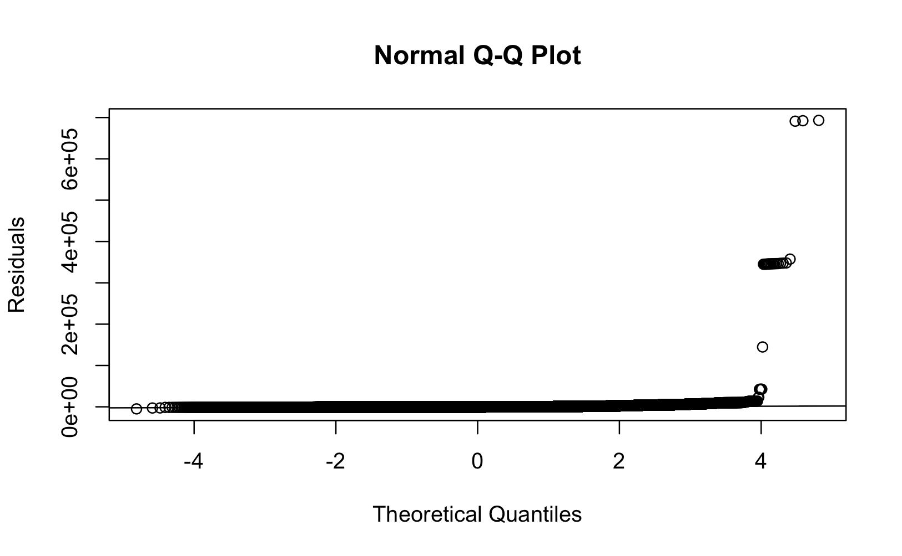
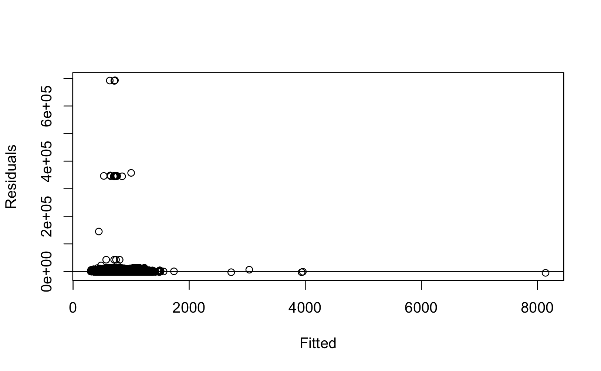

# Trip Prediction of Shared Micromobility in Austin

## Overview

Shared micromobility systems, such as bicycles and e-scooters, have become an increasingly popular transportation option in urban areas. Predicting trip duration can help operators anticipate demand, improve vehicle distribution, and better understand the factors that influence how these services are used.

This project develops a **multiple linear regression model in R** to predict shared micromobility trip duration in Austin, Texas. The analysis examines how trip distance, vehicle type, month, origin district, time of day, and day of week influence trip duration.

## Data

The analysis uses the **Shared Micromobility Vehicle Trips** dataset from the City of Austin Open Data Portal. The complete dataset contains more than 15 million trips from 2018–2022.

For this analysis, trips from **January, May, and September 2021** were selected, resulting in an initial dataset of **959,790 observations**.

The variables used in the model include:

- **Trip Duration** – duration of the trip in seconds
- **Trip Distance** – distance traveled in meters
- **Vehicle Type** – bicycle, scooter, or moped
- **Month**
- **Hour**
- **Day of Week**
- **Council District of Trip Origin**

## Exploratory Data Analysis

Initial exploration showed that both trip duration and trip distance were heavily right-skewed and contained extreme observations.

A log transformation was applied to both variables to reduce skewness and improve the relationship between trip distance and trip duration.

<p align="center">
  
  
</p>

<p align="center">
  <em>Distribution of trip duration before and after log transformation.</em>
</p>

## Methodology

The initial multiple linear regression model predicted trip duration using trip distance, vehicle type, month, origin district, hour, and day of week.

The modeling process included:

1. **Variable Transformation** – Log transformations were applied to trip duration and trip distance to address skewness and improve model fit.
2. **Multicollinearity Analysis** – Variance Inflation Factors (VIF) were examined to identify potential multicollinearity among predictors.
3. **Model Selection** – Backward selection using AIC was used to evaluate whether removing predictors improved the model.
4. **Outlier Analysis** – Potential outliers were identified using Bonferroni-adjusted studentized residuals and evaluated based on plausible travel speeds.
5. **Influential Point Analysis** – Cook's distance was used to identify observations with unusually large influence on the fitted model.
6. **Regression Diagnostics** – Q-Q and residuals-versus-fitted plots were examined to assess regression assumptions.

### Influential Observations

Cook's distance was used to identify observations that could have a disproportionate influence on the regression model.

<p align="center">
  
</p>

Removing the most influential observations did not produce meaningful changes in the regression coefficients or statistical significance, so these observations were retained in the final analysis.

## Regression Diagnostics

Regression diagnostics were used throughout the modeling process to evaluate the assumptions of the linear regression model.

<p align="center">
  
  
</p>

The initial model showed substantial departures from the regression assumptions. After transforming the variables and addressing implausible outliers, model fit improved substantially. However, the final model still exhibited some heteroscedasticity and deviations from normality in the tails.

## Final Model

The final model was:

**log(Trip Duration) ~ log(Trip Distance) + Vehicle Type + Month + Council District + Hour + Day of Week**

The final model achieved:

| Metric | Result |
| --- | ---: |
| R² | **0.5036** |
| RMSE | **170.98 seconds** |
| Original Model RMSE | 563.54 seconds |
| RMSE Reduction | **69.66%** |

The transformation and data-cleaning process substantially improved predictive performance compared with the original model.

## Results & Conclusion

The regression analysis showed that trip duration was associated with **distance, vehicle type, month, origin district, time of day, and day of week**. Longer distances were associated with longer trips, while scooter trips were approximately **7.3% shorter than bicycle trips**. The analysis also identified temporal and spatial patterns, with trip duration varying across months, council districts, hours of the day, and days of the week.

The final model achieved an **R² of 0.5036** and an **RMSE of 170.98 seconds**, representing a **69.66% reduction in RMSE** compared with the original model. While these results show a substantial improvement in predictive performance, the remaining heteroscedasticity and non-normality of the residuals indicate that additional transformations, interaction terms, or more robust modeling approaches could further improve prediction.

Overall, the analysis demonstrates how regression modeling can be used not only to predict micromobility trip duration but also to identify patterns that could help operators better anticipate demand and optimize vehicle distribution.


## Repository Structure

```text
.
├── README.md
├── report.pdf
├── appendix.pdf
│
├── code/
│   └── analysis.Rmd
│
└── figures/
    ├── boxplot_trip_duration_month.png
    ├── cooks_distance.png
    ├── log_trip_distance_distribution.png
    ├── log_trip_duration_distribution.png
    ├── qq_plot_initial.png
    ├── residuals_fitted_baseline.png
    ├── trip_distance_distribution.png
    └── trip_duration_distribution.png
```

## Full Report

For a detailed discussion of the exploratory analysis, regression methodology, model diagnostics, and results, see the [full project report](report.pdf). The complete regression output is available in the [appendix](appendix.pdf).
